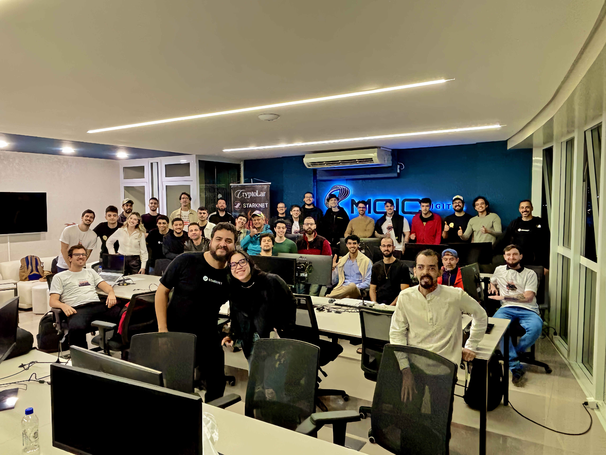
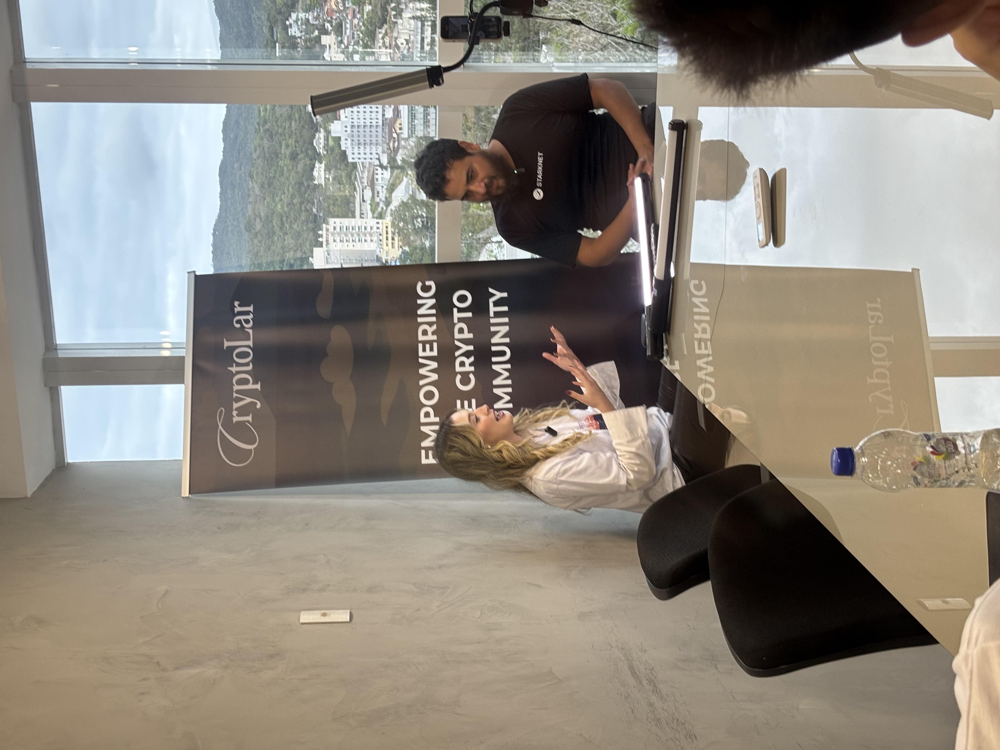
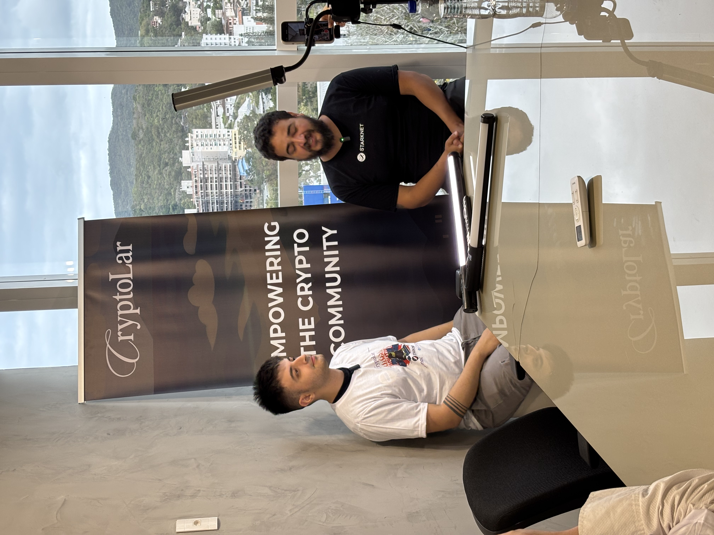
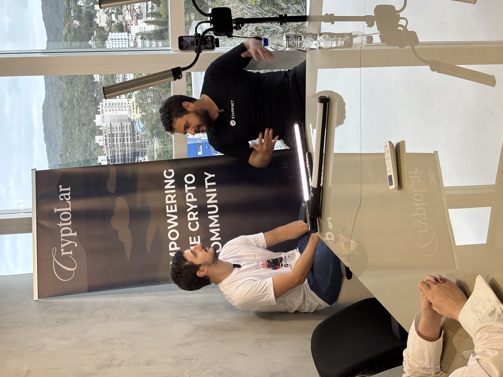

# 🧾 Hackathon Report — CryptoLar × Starknet: O Hackathon — Ato I

### 📍 Overview  
- **Event Name:** CryptoLar × Starknet: O Hackathon — Ato I  
- **Date:** September 27 – October 4, 2025  
- **Location:** MOIC Digital, Florianópolis, Brazil  
- **Organizers:** CryptoLar & OpenSense  
- **Partner:** Starknet Foundation  
- **Participants:** **27 builders**  
- **Prize Pool:** **R$15,000 (~USD 2,727)**  
- **Media Folder:** [📸 Google Drive – Event Photos & Videos](https://drive.google.com/drive/u/0/folders/1o9ws8C60gkHuQ2aoGg5RGSCjBvSKVoo0)

---

### 🎯 Objectives  
- Onboard Brazilian developers into the Starknet ecosystem and the Cairo language.  
- Encourage practical dApp building through real-world use cases and hands-on mentorship.  
- Strengthen ties between the global Starknet ecosystem and the emerging Brazilian builder community.  

---

### 🧩 Structure  
- **Format:** Hybrid (in-person kickoff + one-week online sprint)  
- **Duration:** 7 days  
- **Venue:** MOIC Digital, Florianópolis  
- **Tracks:** Beginner & Advanced  
- **Deliverables:** GitHub repo, video pitch, and presentation deck  
- **Judges & Mentors:** Felipe Novaes, Ranulfo Paiva, Ion Neto, Alexandre Melo, and others.  

---

### 📊 Results Summary  

| Placement | Project | Prize (R$) | Approx. (USD) | CopperX Email | Submitted By |
|------------|----------|-------------|----------------|----------------|---------------|
| 🥇 1st | **StarkVIP-Proof** | **R$6,200** | **~$1,127 USD** | victorvmafra97@gmail.com | @vvmafra |
| 🥈 2nd | **HabitChain** | **R$5,800** | **~$1,055 USD** | gobannondutra@gmail.com | @gdutra |
| 🥉 3rd | **zkStay** | **R$1,000** | **~$182 USD** | felipe.g.datascience@gmail.com | @FelipeGabr |
| 🎖️ 4th | **CryptoScore** | **R$1,000** | **~$182 USD** | fabio.noth@gmail.com | @FabioNoth |
| 🎖️ 5th | **NEXUS Hospitality** | **R$1,000** | **~$182 USD** | maiconloure@gmail.com | @mikhaeldev |
| **Total** | — | **R$15,000** | **~$2,727 USD** | — | — |

---

## 🧠 Project Summaries  

---

### 🛡️ **Project: StarkVIP-Proof**  
**Prize:** 🥇 First Place — R$6,200 (~$1,127 USD)  
**Starknet Wallet:** `0x012E917bB42DA9612A519304289EBDb24b29fbcaDd076D4cc4d0f11c25788bb2`  
**Submitted by:** @vvmafra  

**Description:**  
StarkVIP-Proof is a Zero-Knowledge Proof (ZK) based solution that enables private, verified access control for Telegram groups and online communities — without exposing any wallet data.  

**Problem Solved:**  
Users today must reveal their wallet balance publicly to prove eligibility, exposing their entire transaction history and compromising privacy. StarkVIP-Proof allows users to cryptographically prove ownership of a minimum $STRK balance through ZK proofs, ensuring privacy, exclusivity, and decentralization.  

**Development Challenges:**  
- Ensuring compatibility between ZK and Starknet libraries required multiple retries and version adjustments.  
- The lack of practical examples in official libraries made ZK proof generation and verification more complex.  
- Noir circuits generated valid proofs locally but failed verification with Garaga contracts, requiring a redesign of serialization and proof validation flows.  

**Team Members & GitHub:**  
- Ana Clara Rosa — Telegram: @anaclarac  
- Victor Venturelli Mafra — [github.com/vvmafra](https://github.com/vvmafra)  
- João Rubens Belluzzo Neto — [github.com/bellujrb](https://github.com/bellujrb)  

**Repository:** [github.com/vvmafra/stark-VIP](https://github.com/vvmafra/stark-VIP)  
**Presentation:** [Canva Deck](https://www.canva.com/design/DAGvXvZ5kac/NXhGfk7pZveA-zdEoZd6cQ/view)  
**Demo Video:** [YouTube – StarkVIP-Proof Presentation](https://www.youtube.com/watch?v=r7OOP6-E_Ag)  

**Judging Summary:**  
Innovation 5 | Technical Execution 4.7 | Usefulness 5 | Organization 5  

**Feedback:**  
Excellent use of Starknet’s ZK stack to enable real-world privacy and verification. Technically mature and well-presented.  

**Media Appendix:**  

---

### 🔗 **Project: HabitChain**  
**Prize:** 🥈 Second Place — R$5,800 (~$1,055 USD)  
**Starknet Wallet:** `0x05D4E26c1d756EC1374E6803611efa1314370d5fde3600a3aFF720F95aaDA771`  
**Submitted by:** @KopMark  

**Description:**  
HabitChain is a dApp on Starknet designed to help users build daily habits by staking $STRK tokens on their personal goals.  

**Problem Solved:**  
Traditional habit trackers lack tangible incentives. HabitChain integrates behavioral economics and crypto mechanics, turning personal discipline into a provable, on-chain process with rewards and penalties.  

**Development Challenges:**  
- Setting up testnet RPCs and configuring wallets.  
- Integrating the staking contract and automating day transitions.  
- Designing the full staking logic with group-based reward redistribution.  

**Team Members & GitHub:**  
- Markkop — [github.com/Markkop](https://github.com/Markkop)  
- Gustavo Dutra — [github.com/dutragustavo](https://github.com/dutragustavo)  
- Henrique Pereira — [github.com/hpereira1](https://github.com/hpereira1)  
- Artur Simon — [github.com/artur-simon](https://github.com/artur-simon)  

**Repository:** [github.com/Markkop/habit-tracker-strk](https://github.com/Markkop/habit-tracker-strk)  
**Presentation:** [Google Slides Deck](https://docs.google.com/presentation/d/1Pv5pl5bIrczLMGfJgIy8NHV3IkbuWbtl57vSDdO2A2Y/edit?usp=sharing)  
**Demo Video:** [YouTube – HabitChain Demo](https://www.youtube.com/watch?v=uO4WqPdIyWU)  

**Judging Summary:**  
Innovation 4.5 | Technical Execution 4.5 | Usefulness 4.5 | Organization 5  

**Feedback:**  
A great concept merging self-improvement and DeFi. Needs more depth in liquidity strategies and verification mechanisms but has solid potential for production deployment.  

---

### 🏠 **Project: zkStay**  
**Prize:** 🥉 Third Place — R$1,000 (~$182 USD)  
**Starknet Wallet:** `0x04832F6c0678C2033a772FECF8539d51F7C5569104Db2A5dF85A23Ec51aAd490`  
**Submitted by:** @FelipeGabr  

**Description:**  
zkStay is a decentralized P2P rental platform built on Starknet — a censorship-resistant alternative to Airbnb.  

**Problem Solved:**  
zkStay eliminates intermediaries, reducing fees (up to 20%) while returning privacy and control to hosts and guests.  

**Development Challenges:**  
- Integration with Starknet.js due to versioning issues.  
- Frontend wallet connection reliability.  

**Team Members & GitHub:**  
- Cristian Pietro — [github.com/cristianpp](https://github.com/cristianpp)  
- Vinicius Mafra — [github.com/vinimaffra03](https://github.com/vinimaffra03)  
- Felipe Gabriel — [github.com/FG-SC](https://github.com/FG-SC)  
- Guilherme Binsfeld — [github.com/guilhermebins](https://github.com/guilhermebins)  
- William Rodrigues — [github.com/VVillRodr](https://github.com/VVillRodr)  

**Repositories:**  
- [Frontend](https://github.com/vinimaffra03/zkStay)  
- [Contracts](https://github.com/vinimaffra03/zkStay-contract)  

**Presentation:** [Canva Deck](https://www.canva.com/design/DAG0ZN8-7aI/Td0Kfg9-tMR_bFc0PUc1Uw/edit)  
**Demo Video:** [YouTube – zkStay Pitch](https://youtu.be/ORXEOckmN-0)  

**Judging Summary:**  
Innovation 3 | Execution 3 | Usefulness 2.5 | Organization 4  

**Feedback:**  
Needs zk-proof integration and a more original UX narrative. Well organized with a functional MVP.  

---

### 💳 **Project: CryptoScore**  
**Prize:** 🎖️ Fourth Place — R$1,000 (~$182 USD)  
**Starknet Wallet:** `0x028163cac08f54d707bf425530a893791af4c4c9beeb984895e07cbb718f9be4`  
**Submitted by:** @FabioNoth  

**Description:**  
CryptoScore creates a decentralized financial trust score for wallets using on-chain data, represented by non-transferable Soulbound NFTs.  

**Problem Solved:**  
DeFi depends on over-collateralization. CryptoScore introduces a decentralized credit score, enabling access to credit with lower collateral.  

**Development Challenges:**  
- Integrating APIs (The Graph, Covalent).  
- Implementing Soulbound NFTs.  
- Cairo contract time constraints.  

**Team Members & GitHub:**  
- Fabio Noth — [github.com/fabionoth](https://github.com/fabionoth)  
- Kunah — [github.com/Kunhah127](https://github.com/Kunhah127)  

**Repository:** [github.com/fabionoth/cryptoscore](https://github.com/fabionoth/cryptoscore)  
**Presentation:** [Google Drive Deck](https://drive.google.com/file/d/1-ZfTWbLRKT-gC_iQMCK6z7hSrSscZ_fd/view)  

**Judging Summary:**  
Innovation 4 | Execution 3 | Usefulness 2 | Organization 2  

**Feedback:**  
Strong concept with potential to evolve into a credit primitive. Needs more backend and zk integration.  

---

### 🌍 **Project: NEXUS Hospitality**  
**Prize:** 🎖️ Fifth Place — R$1,000 (~$182 USD)  
**Starknet Wallet:** `0x069fcF671Fd2F307c95FCb34E6133cECdc1188E23c48BfB7559C0d9C14CeE289`  
**Submitted by:** @mikhaeldev  

**Description:**  
NEXUS Hospitality is a regenerative hospitality platform combining Web3 technology with sustainable travel, rewarding eco-friendly behavior.  

**Problem Solved:**  
Centralized booking platforms drain host and guest value through high fees. NEXUS restores fairness using escrow and tokenized loyalty.  

**Development Challenges:**  
- Transaction version mismatch during deployment.  
- SDK compatibility testing for contract verification.  

**Team Members & GitHub:**  
- Daniel Roger Gorgonha — [github.com/danielgorgonha](https://github.com/danielgorgonha)  
- Felipe Santos — [github.com/felpssdev](https://github.com/felpssdev)  
- Kinza Marcato  
- Maicon Lourenço — [github.com/maiconloure](https://github.com/maiconloure)  

**Repository:** [github.com/maiconloure/nexus-hospitality-app](https://github.com/maiconloure/nexus-hospitality-app)  
**Presentation:** [Google Drive Deck](https://drive.google.com/file/d/184J7-oLDWCUi5Xn_7-5aHv_jVhP-06Zy/view)  
**Demo Video:** [YouTube – Nexus Demo](https://youtube.com/shorts/DWpkEOccWm8?feature=share)  

**Judging Summary:**  
Innovation 2 | Execution 1 | Usefulness 3 | Organization 2  

**Feedback:**  
Compelling sustainability concept with early-stage implementation. Needs stronger technical validation.  

---

## 🧮 Judging Summary Appendix  

| Project | Innovation | Technical Execution | Usefulness | Organization | Feedback Summary |
|----------|-------------|----------------------|-------------|----------------|------------------|
| **StarkVIP-Proof** | 5 | 4.7 | 5 | 5 | Excellent privacy use case; technically mature and aligned with Starknet’s vision. |
| **HabitChain** | 4.5 | 4.5 | 4.5 | 5 | Great behavioral DeFi app; needs liquidity depth. |
| **zkStay** | 3 | 3 | 2.5 | 4 | Functional MVP; requires zk-proof integration. |
| **CryptoScore** | 4 | 3 | 2 | 2 | Solid foundation; needs backend improvements. |
| **NEXUS Hospitality** | 2 | 1 | 3 | 2 | Innovative sustainability use case; early stage. |

---

### 📈 Conclusion  
The **CryptoLar × Starknet Hackathon** successfully brought together **27 Brazilian builders** developing privacy, DeFi, and sustainability applications using Starknet.  

Both **StarkVIP-Proof** and **HabitChain** were identified by the organizing team as **grant-worthy** projects, with strong technical depth and ecosystem impact potential.  

> We kindly request the Starknet Foundation’s guidance on how to proceed with connecting these teams to **grant programs or follow-up development support**.

**Media & Assets:**  
📁 [Google Drive – Event Photos & Videos](https://drive.google.com/drive/u/0/folders/1o9ws8C60gkHuQ2aoGg5RGSCjBvSKVoo0)

---

# 👩‍⚖️ Judges  

## Alexandre Melo
- **Role:** Founder of CryptoLar and OpenSense  
- **Org:** Web3 Security Researcher  
- **Bio:** Founder of CryptoLar and OpenSense; Web3 security researcher and community leader.  
- **LinkedIn:** [linkedin.com/in/alexoncrypto](https://www.linkedin.com/in/alexoncrypto)  
- **Twitter:** [@mis4nthr0pic](https://twitter.com/mis4nthr0pic)  
- **Telegram:** [t.me/cryptolarbrasil](https://t.me/cryptolarbrasil)

---

## Felipe Novaes
- **Role:** Blockchain Auditor and Researcher  
- **Bio:** Dev for 24+ years; led people and projects. Language-agnostic: picks the right tool for the job.  
- **LinkedIn:** [linkedin.com/in/felipenovaesrocha/](https://www.linkedin.com/in/felipenovaesrocha/)  
- **Twitter:** [@FelipeNovaesFR1](https://x.com/FelipeNovaesFR1)  
- **Telegram:** [t.me/felipenovaesrocha](https://t.me/felipenovaesrocha)

---

## Ernesto De Oliveira
- **Role:** .NET | Blockchain | Web3 | AI  
- **Bio:** Backend developer focused on .NET, blockchain, Web3 and AI; Starknet researcher.  
- **LinkedIn:** [linkedin.com/in/ernesto-de-oliveira/](https://www.linkedin.com/in/ernesto-de-oliveira/)  
- **Twitter:** [@0xErnesto](https://x.com/0xErnesto)  
- **Telegram:** [t.me/ZxErnesto](https://t.me/ZxErnesto)

---

## Ranulfo Paiva Sobrinho
- **Role:** Cambiatus & CofiBlocks Co-Founder; Starknet Ambassador (Brazil)  
- **Org:** Ph.D. and postdoctoral (UNICAMP)  
- **Bio:** Ph.D. and postdoctoral in Economics and Environmental Cryptoassets for Sustainability at UNICAMP (Brazil).  
- **LinkedIn:** [linkedin.com/in/ranulfosobrinho/](https://www.linkedin.com/in/ranulfosobrinho/)  
- **Twitter:** [@ranulfovm](https://x.com/ranulfovm)  
- **Telegram:** [t.me/ranulfovm](https://t.me/ranulfovm)

---

## Isaque Coelho
- **Role:** AI Engineer | Multi-Agent Systems & LLMs  
- **Org:** CrewAI, LangChain, OpenAI API, AWS  
- **Bio:** AI engineer focused on multi-agent systems and LLMs with CrewAI, LangChain and AWS/OpenAI stack.  
- **LinkedIn:** [linkedin.com/in/coelhoxyz/](https://www.linkedin.com/in/coelhoxyz/)  
- **Twitter:** [@coelhoxyz](https://x.com/coelhoxyz)  
- **Telegram:** [t.me/coelhoxyz](https://t.me/coelhoxyz)

---

## Lorenzo Baumgratz
- **Role:** Team Lead @ MOIC Digital  
- **Org:** Computer Engineering | Crypto | Web3  
- **Bio:** Team lead at MOIC Digital; computer engineering applied to crypto, blockchain and Web3.  
- **LinkedIn:** [linkedin.com/in/lorenzo-baumgratz/](https://www.linkedin.com/in/lorenzo-baumgratz/)  
- **Twitter:** [@LorenzoBaumgrtz](https://x.com/LorenzoBaumgrtz)  
- **Telegram:** [t.me/LBZAO](https://t.me/LBZAO)
